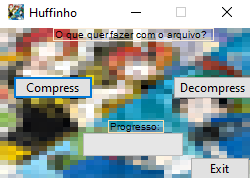

# Some-things
Just a Huffman Compress/Decompress code, an update from 4 years ago, but now in c# with Graphic User Interface

# Huffman GUI at start

# Huffman in CSharp compress
# Huffman in CSharp decompress

